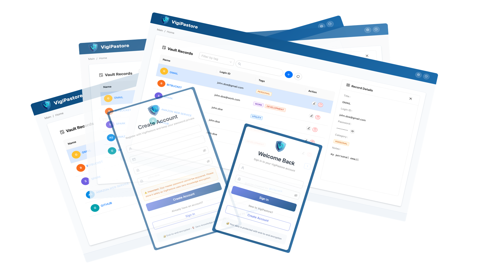

#  VigiPastore




Personal zero-knowledge password vault for secure password management.

## Main Features

- **Secure password storage and management using end-to-end encryption**: Store and organize passwords with encryption that protects data from server access.
- **OPAQUE-based authentication for privacy-preserving login**: Login process uses OPAQUE protocol to verify credentials without exposing passwords to the server.
- **Zero-knowledge architecture ensuring data privacy**: Design ensures the server never sees or stores unencrypted data, keeping your information private.
- **Client-side encryption ensuring data is encrypted before transmission**: All encryption occurs on your device before data is sent, adding an extra layer of security.

## Project Structure

```
├── backend/          # Python FastAPI backend
├── frontend/         # React + Vite frontend
└── deployments/      # Docker Compose deployment
```

## Prerequisites

- Python 3.11+
- Node.js 18+
- Docker & Docker Compose


## Tech Stack

- **Backend:** Python: FastAPI (REST API), SQLAlchemy (ORM), PostgreSQL (database), JWT & OPAQUE (authentication)
- **Frontend:** React (TypeScript), Vite (build tool), Tailwind CSS & Ant Design (styling)
- **Deployment:** Docker, Docker Compose, nginx (reverse proxy)

## Installation

### Local Development Setup

1. **Clone the repository:**
   ```bash
   git clone https://github.com/h3yzack/vigipastore.git
   cd vigipastore
   ```

2. **Backend Setup:**
   ```bash
   cd backend
   python -m venv .venv
   source .venv/bin/activate  # On Windows: .venv\Scripts\activate
   pip install -r requirements.txt
   # Run database migrations
   alembic upgrade head
   ```

3. **Frontend Setup:**
   ```bash
   cd frontend
   npm install
   ```

4. **Configure Environment (Optional):**
   
   Set up `.env` files in `backend/` directory if needed for custom configurations.

   ```bash
   cd backend
   cp .env.example .env
   # Edit .env with your actual configuration
   ```

4. **Configure Environment (Optional):**
   
   Set up `.env` files in `backend/` and `frontend/` directories if needed for custom configurations.

5. **Start the Application:**
   - Backend: `uvicorn app.main:app --reload` or `make run` (from backend directory)
   - Frontend: `npm run dev` (from frontend directory)
   - Access the app at `http://localhost:5173` (frontend) and `http://localhost:8000/docs` (API docs)

### Docker Deployment

For production or testing the full stack:

```bash
cd deployments
docker-compose up --build
```

This starts all services including PostgreSQL, backend API, frontend, and nginx reverse proxy.

## Usage

1. Open your browser and navigate to `http://localhost:5173` (local dev) or `http://localhost:8080` (Docker).
2. Register a new account or log in.
3. Create and manage your password vaults securely.
4. All data is encrypted client-side before transmission.

## Security Notice

This project is intended for educational and personal use. For production use, ensure HTTPS, regular security audits, and updated dependencies.

## Contributing

Contributions are welcome! 

## License

This project is licensed under the GNU General Public License v3.0 - see the [LICENSE](LICENSE) file for details.
